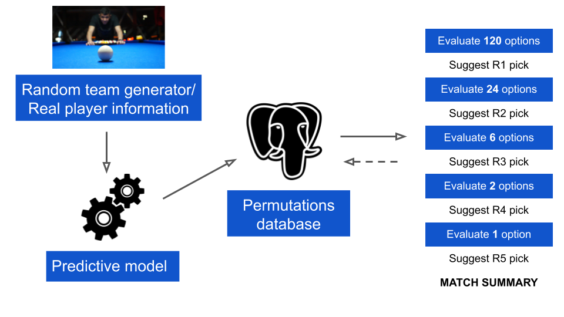
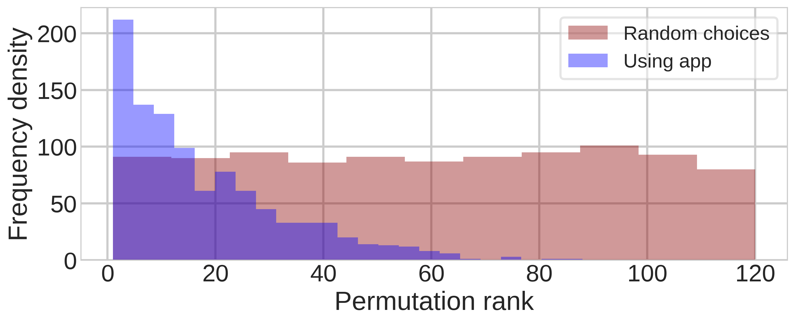
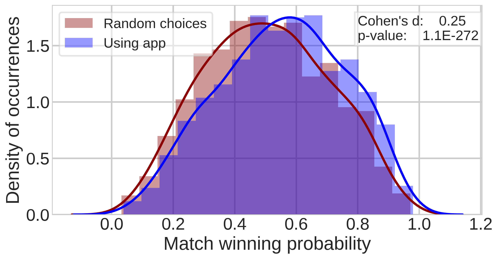

# Pool Team Captain Match Assistant
## Using machine learning, SQL, and Flask to gain a competitive advantage

Amateur pool league matches consist of two teams of players battling it out to win the most points as determined by that particular league's scoring system. Teams of 5 players in the North American Poolshooters Association (NAPA) play 5 consecutive individual matches, with each player playing exactly once. To promote inclusivity, the league uses an equalizing handicap system, where a lower ranked player requires less games to win a match than a higher ranked opponent. In each round, the team captain selects their player choice to compete against the selected player on the opposing team. The captains take turns to pick their player first, with a coin flip deciding who picks first in round 1.

The two main goals of this project were:
* Can pool match outcomes be predicted using machine learning, in spite of the equalizing handicap?
* Can the predictive outcomes be used to inform player selection strategies, in order to maximize a team's chances of victory?

The end product is a Flask web application which team captains can consult in-game to receive an informed suggestion of which player they should choose to play the next individual match.
Try the app at [magic8billiards.herokuapp.com](magic8billiards.herokuapp.com) ! 

## Overview

Player information for both teams is entered by the user on the app homepage. Since there are 5 players on each team, each match has 120 possible permutations! These permutations are fed to a machine learning model which generates a table of predicted outcomes, stored in a central postgreSQL database. 
During the first round, the optimal first choice player is suggested to the user, who then has the option to select this player or choose another player from their team. After entering the player choice from the opposing team, this individual matchup is added to the database. Subsequently, there are are 24 (120/5) remaining possible permutations. For the second round, the optimal player is calculated based on these remaining permutations. The match continues in this fashion until all 5 players have been selected on each team.

## File descriptions

* `napa_app` contains the files for running the Flask web application. See readme inside this folder for a detailed description of contents.
* `models` contains `model_selection.ipynb`, a notebook detailing the machine learning models that are called when using the application, along with the model pickle files. `old models` contains some inital exploration of NAPA data along with a PDF document describing some inital insights.
* `tests` contains `random_team_test.ipynb`, which is used to perform simulations of app usage with random team entries. The results of several tests using different player selection methods are also stored here.

## Why use this app?

As a team captain, strategizing your lineup is hard! The last thing you want is your killer player to be taken down by a hotshot who's skill level is way too low for their ability. Even if you carefully research your opponent players' form (or happen to know which of their players takes advantage of the Wednesday night 2 for 1 whiskey deal), your opposing captain will almost certainly make player choices which foil the lineup you try to carefully engineer.  The Magic8Billiards app ensures that no matter how wily your opposing captain thinks they are, you'll always be one step ahead with your player choices. By considering additional factors such as player historical win rate, number of games played, and number of games required to win, the machine learning model produces a predicted winning probability for each player on your team versus each player on the opposing team, with an average error of 2%. This enables all the possible match lineup permutations to be ranked in order of best to worst. In each round, the app implements a risk-reducing strategy to identify which player should be chosen in order to keep the predicted match winning probability as high as possible.

Lets say you have a team of 5 players, Curtis, Milton, Judith, Tessa, and Jimmy, while your opponent, Slick Bill, is bringing his 5 players, Chris, Paul, Stephanie, Steve, and Juana, to the table. You've seen Slick Bill's team slamming in trick shots while practising, and while they are clearly a step ahead of your guys, you think that there a few ways that you stand an even chance of taking them down. Tessa is your star player and could beat 90% of players in the league, while Jimmy has been putting in hours of practice recently and is playing well above his skill rating. Ideally, you want Tessa and Jimmy to play Paul and Juana, Slick Bill's ace shooters, leaving the remaining matchups to be fairly even. You win the coin toss and choose to pick second. Slick Bill confidently calls Paul up to play the first matchup. You respond by selecting Tessa as his opponent, who bests him in a closely fought, high quality encounter. Now that it's your turn to pick first, you choose Jimmy, thinking that Bill will want to quickly even the scores by playing another one of his best players. However, Bill instead chooses to play Stephanie, the lowest ranked player on his team. Due to the handicap equalizer, she only needs to win 2 games to win the matchup compared to Jimmy who needs 4. In a long and scrappy match, Jimmy loses focus and Stephanie wins the 2 games she needs. Your worst fears are confirmed when Juana crushes Curtis in the next matchup, followed by Milton losing out to Steve.

How could things have gone differently? Well, this strategy was quite high risk, since if we didn't get the two key matchups that we were aiming for, then our chances of victory dropped dramatically. On the other hand, it is almost impossible to weigh up all 120 permutations in your head at once, and that's assuming that you have accurately assessed the strengths of each player! This is where the Magic8Billiards app comes in, which handles all these mental calculations so you don't have to. You can trust that the player recommendations will lead to a permutation which ranks among the top predicted outcomes for the match. The plot below shows the where the eventual match permutation ranked against all other possible permutations for that match, for 1000 simulated matches. Red shading indicates when random player choices were made by both team captains, whereas blue shading corresponds to one team using the player recommendations from the app (while the opposing captain still makes random choices). When using the app, the majority of times, the final lineup is either the optimal lineup, or very close to optimal.

What does this mean in terms of the winning likelihood? Apart for exceptional cases (involving bonus points), to win a team match in NAPA requires winning 3/5 of the individual matchups. Assuming that each matchup is an independent event, the overall match winning probability can be found by aggregating all the possible player win/loss probabilities for that particular permutation, and summing those outcomes where your team is predicted to win at least 3 of the matchups. In the next graph, the match winning probability distribution is plotted for the 1000 match simulations, for the same two cases previously discussed. 

 

